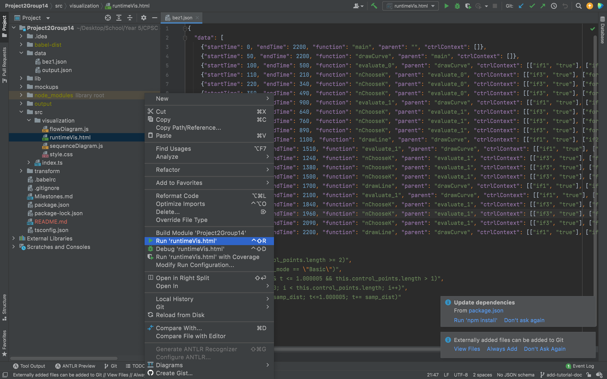
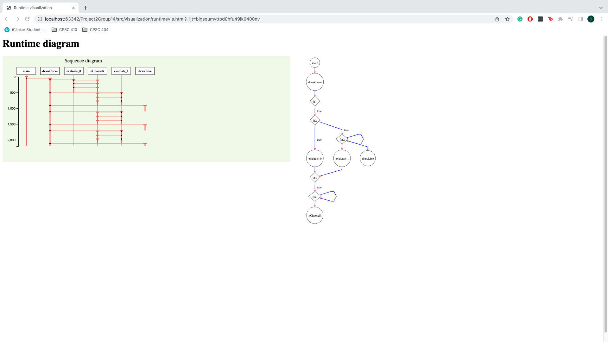
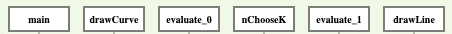
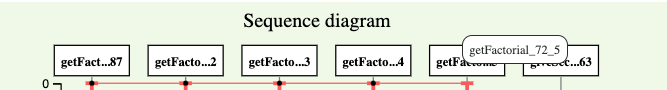
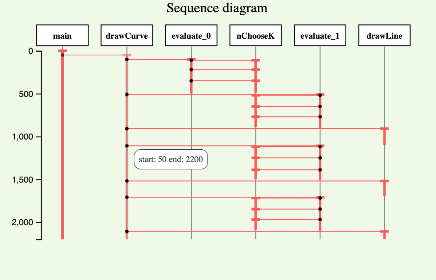
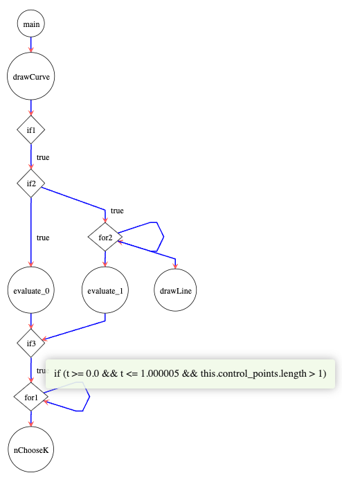
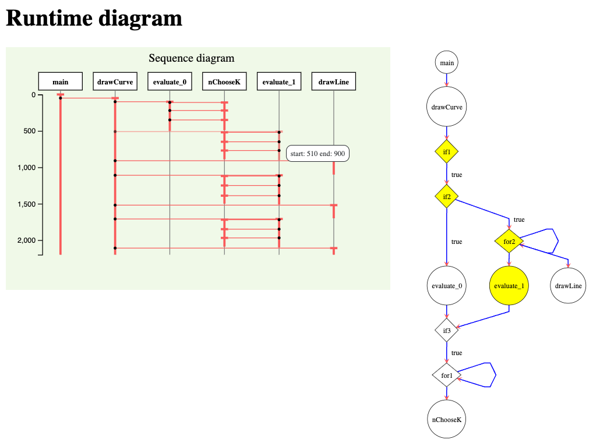

# Dynamic Program Analysis Tool for Runtime and Control Flow

## About the tool
Our analysis tool is used to track the runtimes and control flow of user-defined functions within a program.

The tool is intended for all JavaScript programmers. It helps them to identify bottlenecks to create efficient programs and better understand how their programs work.

The tool produces two diagrams that can be used together:
- Sequence diagram
- Control flow diagram

## Setting up the tool
1. Make sure you have `npm` installed
2. In commandline, run `npm i` to install tool dependencies

## Running the tool
1. Put your source code under `transform/src`
2. In commandline, run `npm buildtsc`
3. Run `npm babel:transform`
4. The instrumented version of your file is found under the folder `babel-dist`
5. Run the instrumented version of your file via `node babel-dist/your-file-name.js`
6. Run `runtimeVis.html` under `src/visualization`. 
    - The easiest way is to do it through IntelliJ where a localhost server will be automatically set up.
    - 
7. Then, you'll be able to see the visualization in your browser
    - 

## Changing JSON file for visualization
By default, the visualization uses the JSON file `output.json` under the `data` folder. When your program runs, its data is outputted into `output.json`. 

To change the JSON file used for the visualization, modify the import statements (i.e., `import JsonData from '../../data/bez1.json' assert { type: 'json' };`) at the top of `flowDiagram.js` and `sequenceDiagram.js` under `src/visualization`.

We have some examples under the `data` folder, like `bez1.json` and `message.json`, that can be viewed.

## Source code best practices
Any code injected by the tool is appended with `$`. To differentiate your code from the tool's code, it's good practice to avoid putting `$` at the end of variable and function names.

Each file is considered as a separate program. The tool is able to generate the visualizations for one program at a time.

## Understanding the visualization
### Sequence diagram
The diagram shows a sequence of calls within your program in milliseconds. It's similar to the general sequence diagram, but it has runtimes adjusted to it.

At the top, you can see the name of methods being called.

The same methods that are called in different points of your program are appended with an underscore and an unique identifier. The unique identifier is the line number of the call to that method within the instrumented code.

In the event of recursion, the method names will be further appended with an underscore and the recursive depth. Recursive depth is 1-based indexed. 

Hover over the names to see the method's name, ID, and recursive depth if applicable.

In the example above, we hover over a recursive program that calculates the factorial of 5. In the second last method, we can see that the call to `getFactorial` has an ID of 72 and it's the 5th recursive call of `getFactorial`.

When you hover over the timeline at different points, you can see the start and end times of each function's run.

To zoom in and out on the sequence diagram, scroll up and down on your mouse. 

### Control flow diagram
While the sequence diagram does show the order in which methods are called, it doesn't show the control flow.

The control flow diagram gives a more detailed view of the conditional branches and loops that occur in a particular run of a program.

When you hover your mouse over a diamond, you see exactly which conditional branch or loop is evaluated.
- 

When you hover over a timeline in the sequence diagram, the matching section in the control flow diagram is highlighted. The highlighting feature helps programmers understand the connection between the two diagrams.
- 
